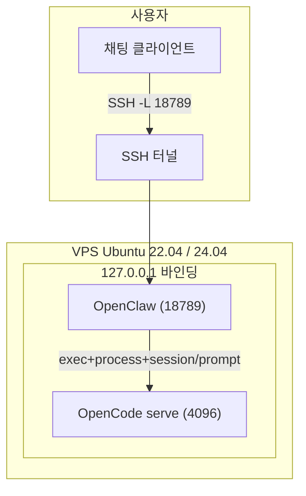

# 나만의 개발비서 - 전체 개요

Contabo VPS(또는 Ubuntu 서버) 위에 OpenClaw + OpenCode를 **스킬 방식**으로 결합한 "나만의 개발비서" 아키텍처입니다.

## 아키텍처 다이어그램

## 포트/프로세스 표

| 서비스 | 포트 | 바인딩 | 설명 |
|--------|------|--------|------|
| OpenClaw Gateway | 18789 | 127.0.0.1 | 채팅/명령 UX, 대시보드 |
| OpenCode serve | 4096 | 127.0.0.1 | 코딩 실행 엔진 |
| DevBridge API | 8080 | 127.0.0.1 | (레거시/선택) 스킬 방식에서는 미사용 |

## 보안 원칙

- **외부 노출**: SSH 22 포트만 허용
- **내부 서비스**: OpenClaw, OpenCode 모두 127.0.0.1 바인딩 (DevBridge는 레거시)
- **18789/8080/4096 포트**: 절대 외부 오픈 금지
- **원격 접근**: SSH 터널링으로만 로컬에서 접근

## 운영 흐름

**스킬 방식**: 자연어 지시("계획해줘", "구현해줘" 등) → 김빌드가 OPENCODE_ACP_WORKFLOW(exec·process·JSON-RPC)로 OpenCode 제어 → 계획/구현/상태 요약 전달. 워크스페이스 `openclaw/workplace/OPENCODE_ACP_WORKFLOW.md` 참고.

## 관련 문서

- [01_CONTABO_SETUP.md](01_CONTABO_SETUP.md) – Contabo VPS 설정
- [01_OCI_SETUP.md](01_OCI_SETUP.md) – (참고) OCI 인스턴스 생성
- [02_SERVER_BOOTSTRAP.md](02_SERVER_BOOTSTRAP.md) – 서버 초기 세팅
- [03_INSTALL_OPENCODE.md](03_INSTALL_OPENCODE.md) – OpenCode 설치
- [04_INSTALL_OPENCLAW.md](04_INSTALL_OPENCLAW.md) – OpenClaw 설치
- [05_ACP_OPENCODE.md](05_ACP_OPENCODE.md) – 스킬 방식 요약·(레거시) acpx 참고
- [06_OPERATIONS.md](06_OPERATIONS.md) – 운영/백업/복구
- [07_OPENCLAW_LLM.md](07_OPENCLAW_LLM.md) – OpenClaw LLM·모델 인증
- [08_OPENCLAW_IDENTITY.md](08_OPENCLAW_IDENTITY.md) – 워크스페이스·역할·정체성 설정
- [09_OPENCODE_SETUP.md](09_OPENCODE_SETUP.md) – OpenCode provider·모델·MCP(Stitch, GitHub 등) 상세
- [05_DEVBRIDGE.md](05_DEVBRIDGE.md) – (레거시 참고) DevBridge API 상세
